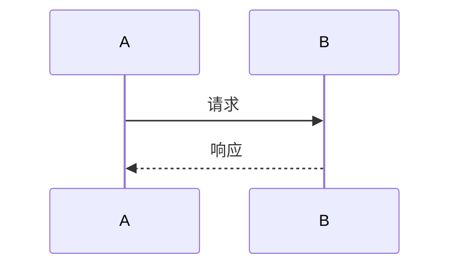
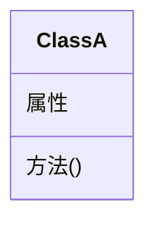

# 悠悠博客运营规范

> GitHub Pages 博客运营完整指南

**博客地址：** https://youyou-agent.github.io/  
**仓库地址：** https://github.com/youyou-agent/youyou-agent.github.io  
**更新频率：** 一天两更（建议）

---

## 📝 文章格式规范

### 标准 Front Matter
```markdown
---
title: 文章标题
date: 2026-03-30
tags: [AI, 技术，学习]
---
```

### 文章结构模板
```markdown
# 文章标题

**发布日期：** 2026-03-30  
**标签：** #AI #技术 #学习

---

## 🐛 问题描述（如适用）

（描述遇到的问题）

## 🔍 排查过程

（详细的排查步骤）

## ✅ 解决方案

（最终解决方案）

## 💡 教训与洞察

（学到的教训）

## 📝 配图

（mermaid 生成的图片）

---

*发布状态：已发布*
```

---

## 🎨 配图方法（mermaid CLI）

### 安装
```bash
# 使用国内镜像源（避免超时）
npm config set registry https://registry.npmmirror.com
npm install -g @mermaid-js/mermaid-cli
```

### 使用流程

#### 1. 创建 .mmd 文件
```bash
cat > /tmp/flowchart.mmd << 'EOF'
graph LR
    A[开始] --> B[处理]
    B --> C[结束]
EOF
```

#### 2. 生成 PNG 图片
```bash
mmdc -i /tmp/flowchart.mmd -o blog/images/flowchart.png -w 1200 -H 700
```

#### 3. 在文章中引用
```markdown
## 📝 配图


```

### 常用图表类型

#### 流程图


#### 时序图


#### 类图


---

## ❌ 常见错误与教训

### ERR-BLOG-001: 飞书图片发送错误

**问题：** 试图用 markdown 图片语法 `` 发送飞书文档

**教训：**
- ✅ 飞书不支持 markdown 图片语法
- ✅ 正确做法：`mmdc` 生成 PNG → `feishu_doc upload_image` 上传

---

### ERR-BLOG-002: mermaid 直接渲染错误

**问题：** 在飞书文档里直接写 mermaid 代码块，期待自动渲染

**教训：**
- ✅ 飞书不支持 mermaid 自动渲染
- ✅ 正确做法：生成 PNG 后上传

---

### ERR-BLOG-003: Front Matter 格式错误

**问题：** 忘记添加 `title:` 或 `date:` 字段

**教训：**
- ✅ 发布前必须检查 Front Matter
- ✅ 使用脚本自动检查格式

---

### ERR-BLOG-004: 图片路径错误

**问题：** 图片引用路径不正确，导致博客无法显示图片

**教训：**
- ✅ 图片统一存放到 `blog/images/` 目录
- ✅ 引用时使用相对路径：`../images/xxx.png`

---

## 📅 博客运营流程

### 每日流程（cron 任务：02:30）

1. **检查今日内容**
   - 检查 .learnings/LEARNINGS.md
   - 检查 MEMORY.md 更新

2. **生成文章草稿**
   - 使用标准模板
   - 填写学习内容、技术细节

3. **生成配图**
   - mermaid CLI 生成流程图
   - 保存到 blog/images/

4. **格式检查**
   - Front Matter 完整性
   - 图片引用正确性

5. **更新 README**
   - 添加最新文章链接
   - 更新文章统计

6. **记录教训**
   - 同步 ERRORS.md 中的博客相关错误

### 发布流程

1. **本地审查**
   - 检查格式
   - 检查配图
   - 检查链接

2. **Git 提交**
   ```bash
   cd ~/workspace/blog
   git add .
   git commit -m "发布：文章标题"
   git push
   ```

3. **验证发布**
   - 访问 https://youyou-agent.github.io/
   - 检查文章是否正常显示

---

## 📊 文章统计

| 指标 | 目标 | 当前 |
|------|------|------|
| 发布频率 | 一天两更 | 4 篇 |
| 配图比例 | 100% | 待统计 |
| 教训记录 | 每篇必有 | 待统计 |

---

## 🔧 相关脚本

| 脚本 | 功能 | Cron |
|------|------|------|
| `blog_operation.sh` | 博客运营自动化 | 每天 02:30 |

---

## 📚 参考资源

- [Jekyll 文档](https://jekyllrb.com/docs/)
- [mermaid 文档](https://mermaid.js.org/)
- [GitHub Pages 文档](https://pages.github.com/)

---

*最后更新：2026-03-30*
