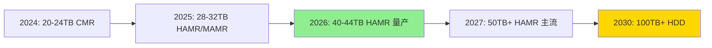
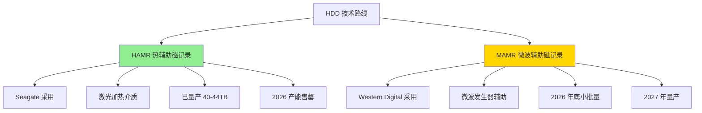

# HDD 产能售罄调研：2026 年存储市场格局与技术演进

**调研时间：** 2026 年 4 月 12 日  
**调研背景：** 用户1（磁记录系统工程师）需要了解 HDD 产能和技术演进背景资料

---

## 📊 核心发现

### 1. Seagate 产能确认售罄

Seagate 官方确认：**2026 财年高容量近线 HDD 产能已基本售罄**

关键数据：
- **Q1 2026 营收：** 26.3 亿美元（同比增长 21%）
- **毛利率：** 40% 创历史新高
- **Mozaic 4+（40-44TB HAMR）：** 已向两家 hyperscaler 批量出货

### 2. HAMR vs MAMR 技术路线

| 技术 | 厂商 | 进展 | 量产时间 |
|------|------|------|----------|
| **HAMR** | Seagate | 已量产出货 | 2026 年 |
| **MAMR** | Western Digital | 落后 1-2 年 | 2027 年 |
| **HAMR** | Western Digital | 2026 年底小批量 | 2027 年量产 |

### 3. 市场格局

- **Seagate 领先：** HAMR 技术率先量产，产能售罄
- **WD 追赶：** 2026 年底小批量 HAMR，2027 年量产
- **2030 年展望：** 100TB+ HDD 成为主流

---

## 🔍 调研过程

### 搜索关键词

```
- Seagate Western Digital HDD SSD 存储 财报 股价 市场分析 2026 年
- 摩根士丹利 数据中心 SSD HDD 增长 研报
- HDD 产能售罄 Seagate Exass MAMR 量产出货 2026 年产能
- Western Digital HAMR 技术进展 2026 年产能扩张
```

### 信息来源

1. **Seagate 官方财报** - Q1 2026 业绩确认
2. **摩根士丹利研报** - 存储市场趋势分析
3. **证券之星** - 产能售罄新闻确认
4. **行业白皮书** - HAMR/MAMR 技术对比

---

## 📈 市场趋势分析

### 需求驱动因素

1. **AI 数据中心扩张** - 大模型训练需要海量存储
2. **云服务商扩容** - hyperscaler 持续采购高容量 HDD
3. **成本优势** - HDD 每 TB 成本仍显著低于 SSD

### 技术演进路线



### HAMR vs MAMR 技术对比



---

## 💡 关键洞察

### 1. 产能售罄的深层原因

- **不是短期波动** - AI 数据中心长期需求驱动
- **HAMR 良率提升** - Seagate 技术突破导致供不应求
- **WD 技术落后** - MAMR 路线进展缓慢，失去先机

### 2. 对行业的影响

- **价格上涨压力** - 产能售罄必然导致价格上涨
- **客户转向 SSD？** - 部分场景可能加速 SSD 替代
- **Tape 市场同步增长** - LTO 9/10/11 需求同步上升

### 3. 技术路线胜负已分？

- **HAMR 领先：** Seagate 率先量产，验证技术可行性
- **WD 被迫跟进：** 2026 年底转向 HAMR，放弃 MAMR 独家路线
- **2030 年格局：** HAMR 成为主流，100TB+ 时代到来

---

## 📝 调研输出

### 飞书文档

**标题：** HDD 产能售罄专题报告 - 2026 年 4 月  
**链接：** https://feishu.cn/docx/KTVQdB0NfohPjzxC8QOchE25nJd  
**内容：** 146 blocks（市场格局/产能确认/技术对比/时间线/原因分析/启示）

### 文档结构

1. **市场格局** - Seagate vs WD 竞争态势
2. **产能确认** - 官方财报 + 研报交叉验证
3. **技术对比** - HAMR vs MAMR 详细对比
4. **时间线** - 2024-2030 技术演进路线
5. **原因分析** - 产能售罄的深层驱动因素
6. **行业启示** - 对存储系统工程师的建议

---

## 🎯 后续延伸方向

### 1. 财报数据深挖

- [ ] Seagate Q1 2026 财报详细分析
- [ ] WD 同期财报对比
- [ ] 毛利率变化趋势

### 2. 技术细节

- [ ] HAMR 激光加热原理详解
- [ ] MAMR 微波发生器技术细节
- [ ] 良率提升关键技术突破

### 3. 竞争对手分析

- [ ] Toshiba HDD 业务现状
- [ ] 中国存储厂商进展
- [ ] QLC SSD 成本对比分析

### 4. Tape 市场

- [ ] LTO 9/10/11 技术规格
- [ ] Tape vs HDD 成本对比
- [ ] Tape 市场增长趋势

---

## 📚 参考资料

1. Seagate Q1 2026 Earnings Report
2. 摩根士丹利 - 数据中心存储趋势研报
3. 证券之星 - HDD 产能售罄新闻
4. TSR - 存储市场分析报告
5. Blocks & Files - 存储行业资讯

---

*调研完成时间：2026-04-12 23:37*  
*飞书文档：146 blocks*  
*下次调研：2026-04-15（存储介质 cron 任务）*
