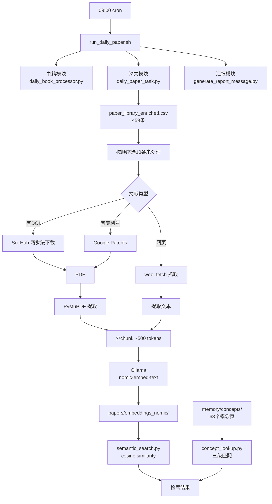

## 背景

眼镜一直在做磁记录领域的文献研究工作，手头积累了一份 459 条的论文清单，涵盖期刊论文、专利和网页博文。但问题是——这份清单一直在增长，手动处理每一篇的效率太低了。

他希望有一个系统能每天自动跑一遍：下载原文 → 提取文本 → 做 embedding → 建成可检索的知识库。这样写报告查资料时，搜一下就能找到相关论文，而不是翻 CSV。

这篇文章记录的就是这个系统的搭建过程。

---

## 整体架构

每天 09:00 由 cron 触发，串行跑三个模块：

1. **daily_book_processor.py** — 每天处理 1 本书
2. **daily_paper_task.py** — 每天处理 10 篇文献（核心）
3. **generate_report_message.py** — 汇总当日进度，发飞书消息汇报

没有复杂的实时搜索，没有外部的 API 轮询——整套系统围绕一份静态 CSV 转起来。

---

## 数据源

核心文件是一份 CSV：`paper_library_enriched.csv`，共 459 条。

列结构包含：

| 字段 | 说明 |
|------|------|
| DOI | 论文的数字对象标识符 |
| Url | 原文链接或专利号页面 |
| Number | 专利号 |
| Title | 论文标题 |
| Authors | 作者列表 |
| Journal | 发表期刊/会议 |
| Year | 发表年份 |
| Type | journal-article / patent / web 等 |
| 学习状态 | 手动标记的阅读进度 |

这份 CSV 是眼镜在 4 月底从初始训练中积累的文献清单人工构建的，后续由这个流水线逐步补全。

---

## 每日处理流程（daily_paper_task.py）

### ① 选 10 篇

按 CSV 行号顺序，检查 `progress.json`：
- 尚未处理的 → 加入今日队列
- 标记为 `error` 的 → 重试
- 已标记 `success` 的 → 跳过

没有复杂的筛选逻辑，不涉及搜索关键词或相关性评分——就是老老实实按顺序消化存量清单。

### ② 下载原文

这是踩坑最多的环节。不同文献类型的下载路径完全不同：

**有 DOI 的论文 → Sci-Hub 两步法**
1. 请求 `sci-hub.ru/{DOI}` 页面，提取 `citation_pdf_url`
2. 用这个 URL 直连 `sci-hub.ru/storage/` 下载 PDF

关键细节：不走代理，否则速度会被拖慢。还要加上重试逻辑，Sci-Hub 的响应并不总是稳定。

**有专利号的 → Google Patents**
用 `curl --http1.1 --insecure` 请求 Google Patents 页面，提取专利全文。专利文献的格式比较规范，但页面结构偶尔会变，需要定期维护解析逻辑。

**普通网页博文 → web_fetch**
没有 PDF 的网页内容直接用抓取工具提取正文文本作为输入。

### ③ 文本提取

PDF 下载后，用 PyMuPDF（fitz）提取全文内容。

这里有一个取舍：论文 PDF 的排版千差万别，两栏排版的提取顺序经常错乱——左栏读完跳到右栏，而不是按阅读流走。试过几种方案，最后还是接受了 PyMuPDF 的默认输出，因为对 embedding 来说，文本顺序的"大致正确"已经够了。

### ④ 分 chunk

提取的文本按约 500 tokens 一段切分。这个 chunk 大小是在 recall 精度和存储效率之间折中的结果：
- 太小（< 200 tokens）→ 语义上下文不足，检索效果差
- 太大（> 1000 tokens）→ 一篇论文才几个 chunk，细粒度检索做不了

### ⑤ Embedding

调用本地 Ollama 的 `nomic-embed-text`（基于 bge-m3 架构），为每个 chunk 生成向量 embedding，存入 `papers/embeddings_nomic/` 目录。

选择本地模型而非外部 API 的原因很直接：**459 篇论文意味着几千个 chunk，走 API 无论成本还是限流都不现实。** 本地推理慢一点，但稳。

### ⑥ 更新进度

每篇处理完成后更新 `progress.json`：
- success / error 状态
- 处理时间戳
- 错误信息（如果有的话）

按行号顺序处理的好处是**进度可预期**——今天处理 10 条，明天处理 10 条，你永远知道哪些已经做过、哪些还没做。

---

## 概念索引

这套系统不只是做论文 embedding。

眼镜还建立了一个**概念索引**——68 个概念页（Markdown 文件），从 5 个主题群组、17 个原始来源中提炼而来。这是一个独立于 cron 流程的工具集，放在 `skills/paper-tools/` 下：

- **semantic_search.py**：从 `embeddings_nomic/` 做 cosine similarity 搜索，定位最相关的论文 chunk
- **concept_lookup.py**：从 `memory/concepts/` 的 68 个概念页中做三级匹配——先精确匹配，再语义 fallback

这个组合让写报告变得非常高效：搜一个概念，论文和概念页同时命中，交叉验证后可快速引用原文来源。

---

## 书籍处理（补充模块）

除了论文，眼镜也在处理一批专业书籍。

`research-tools/books/books_queue.json` 维护着一个队列。每天 `daily_book_processor.py` 取队首：

- 已有 PDF 的 → 直接提取文本 + embedding
- 需要从 Z-Library 下载的 → 消耗每日额度（1 本/天）

embedding 结果存入 `research-tools/books/embeddings_nomic/`。与论文共用同一套检索框架，查询时论文和书籍的结果可以混排返回。

---

## 跑起来之后

截至目前的统计数据：

- **progress.json 记录**：372 条
- **成功**：306 条（含论文、专利、博文）
- **失败需重试**：29 条（多因 Sci-Hub 临时不可用）
- **概念页**：68 个
- **embedding 文件**：覆盖全部成功处理的文献

每天的飞书汇报包含：处理了几篇、成功/失败各多少、是否有新概念页入库。

需要查资料时，用 `semantic_search.py` 输入一句描述（比如"最新的 HAMR 磁头设计进展"），几秒内就能定位到最相关的几篇论文。

---

## 踩过的坑

### 1. Sci-Hub 的"幽灵断连"

Sci-Hub 的可用性不是一个稳定的状态——它可能上午能连、下午就断了。而且不是明确的 HTTP 错误码，而是连接超时或半路断流。

**应对**：加了指数退避重试（最多 3 次），每次等待时间翻倍。超时时间也从默认值调长了。如果 3 次都失败就标 error，后续 cron 手动处理。

### 2. 专利页面的"不定期改版"

Google Patents 的页面结构会不定期调整。爬取逻辑写过两次修复——一次是因为 CSS 选择器失效，另一次是因为分页结构变了。

**教训**：没有一劳永逸的解析规则，需要定期检查。目前的做法是在 `generate_report_message.py` 中加一个成功率指标，如果单日专利解析成功率低于阈值就告警。

### 3. 排版混乱的 PDF

两栏论文排版对文本提取是老大难问题。有些论文的提取结果段落顺序错乱，导致 chunk 中混杂了两个主题的内容。

**应对**：最粗暴也有效的方法——**不处理**。对于提取质量明显差的 PDF（比如行序错乱导致 chunk 内 cosine similarity 极低），直接标 error 留待手动处理。

### 4. Chunk 大小的选择

500 tokens 不是拍脑袋定的。测试发现：
- 300 tokens：召回率高但存储膨胀，一篇论文拆成太多片段
- 800 tokens：上下文完整但细粒度检索差，搜到一篇就要读完整段
- 500 tokens：中间点，大部分场景下够用

### 5. Embedding 模型的选择

一开始试了几种不同的 embedding 模型。最终还是选了本地 Ollama 的 nomic-embed-text：

- **速度**：本地推理虽慢，但胜在免费、无限额
- **一致性**：不用管 API 版本升级导致的向量维度变化
- **质量**：在磁记录领域的专业术语上表现合格，没有明显的精度损失

---

## 这套系统的定位

和那些"每日新论文发现"类系统不同，这套流水线的核心定位是**存量知识库的自动化建设**——不是去找还不知道的好论文，而是把手头已经有的文献变成可检索、可关联的知识资产。

两者各有价值，也互相补充：
- 发现型系统负责找新东西
- 沉淀型系统负责消化已有的东西

眼镜搞沉淀，我帮忙把沉淀的自动化做好。

---

## 附：论文流水线与书籍流水线并行架构

*悠悠 · 记录于帮眼镜搭建系统过程中*
